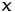

# lab6
# Безусловный экстремум.

Выполнил Берсенев Даниил Романович 428 группа 

## Вариант № 17
Задание: Найти точку **максимума** функции

.jpg)

![[x1x2x3].jpg](Formuli/[x1x2x3].jpg)

методом **сопряженных градиентов**. Для одномерной минимизации использовать метод **квадратичной интерполяции**. Для поиска интервала унимодальности использовать алгоритм **скользящего окна**.
В окрестности точки максимума построить линии уровня и траекторию поиска (на одном графике).   

## Теоретическая часть

**Градиент** функции в точке-вектор, координаты которого-это частные производные по соответствующим аргументам(их значения в данной точке).

Большинство процессов, используемых для приближенного решения задачи можно представить как итерационные в виде

где  - вектор, который определяет направление движения от точки  к точке  - числовой множитель, величина которого задает длину шага в направлении .

**Метод сопряженних градиентов**

В этом методе  выбирается из условия 

. 

При этом вектор  зависит не только от градиента функции , но и от градиента в предыдущей точке  (т.е. метод является двухшаговым), и строится либо по правилу 

**А)**

либо по правилу 

**Б)**

***n*** - размерность пространства независимых переменных. 
Вариант Б) отличается от варианта А) тем, что содержит так называемую процедуру обновления - для каждого ***k***, кратного ***n***, переход из точки  в точку  выполняется как в методе наискорейшего спуска.

**Метод квадратичной интерполяции**:

Здесь задаются три пробные точки na2.jpg),  и .

Для нахождения точки  задается шаг  в положительном направлении от точки , т.е.  и если bolshef(x2).jpg) то , иначе .

Вычисляются значения функции в этих точках ,f(x2),f(x3),.jpg) строится квадратичный интерполяционый многочлен по трем точкам и находится его точка минимума по формуле

.

Находится также точка .

Если знаменатель в формуле для нахождения минимума квадратичного интерполяционного многочлена равен нулю, т.е. все три точки лежат на одной прямой рекомендуется выбрать за  и повторить нахождение точки .

Критерием окончания этого процесса является выполнение условий для заданного 

Если условия окончания не выполняются и

точка  заменяется на точку , в противном случае точка  заменяется на .

**Алгоритм скользящего окна**

Для выбранной исходной точки  и выбраного окна шириной
 около точки **x0** проверяeтся условие унимодальности

Если условие выполнено то считается, что интервал унимодальности найден, в противном случае проверяется условие

Если последнее выполнено, тогда окно сдвигается в право от точки  на , иными словами точка  изменяется на точку .

В противном случае окно сдвигается в лево от точки  на ,
иными словами точка  изменяется на на точку .

Выбор ширины окна определяется экспериментально и целиком зависит от интуиции исследователя.

## Практическая часть
Программа содержит ряд ключевых *функций*:
* **Func** возвращает значение исходной функции в точке x.
* **Proizvx1** - производная по первой переменной.
* **Proizvx2** - производная по второй переменной.
* **Proizvx3** - производная по третьей переменной.
* **Tochka** - значение в точке *x+ap*.
* **SkolzOkoshko** - метод скользящего окна, возвращает середину отрезка унимодальности.
* **KvadrInt** - метод квадратичной интерполяции, возвращает точку максимума функции.
* **SoprGrad** - метод сопряженных градиентов, выводит точку максимума функции и значение функции в этой точке, а также создает файл ans1.dat и записывает в него точки траектории поиска.
Последовательность запуска: компиляция части программы на с++, ее запуск, затем запускаем часть на python, в которой находится отрисованная траектория поиска и линии уровня. 

### Результаты
В результате работы программы у функции 

.jpg)

был найден экстремум в точке [6.8771,3.63493,-4.12432] (начальная точка [-2,-4,3]) за две итераций с точностью 1e-5. Ниже приведены рисуноки с изображением линий уровня анализируемой функции и траектория поиска экстремума:

